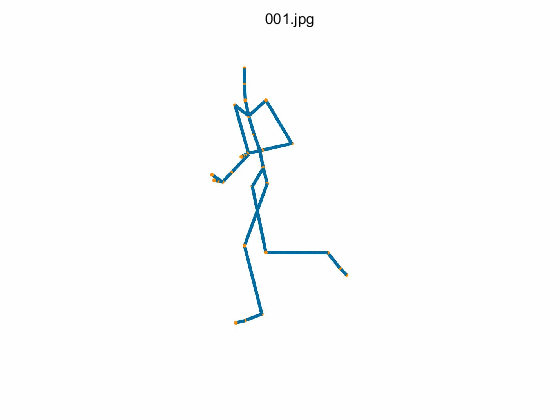

## 3D Position data of CMU mocap (motion capture) benchmark (http://mocap.cs.cmu.edu)

### 1.Folder Instructions

The folder names represent performance of different actors.
Example, Folder name 01 is performance of 1-th actor.

### 2.File Instructions

asf/amc/mat file in every folder.

***.asf** store the skeleton information from CMU lib, just one file in every folder.
***.amc** store the motion information from CMU lib, maybe more than one file in every folder.
***.mat** store the 3D position motion information converted from asf/amc file, The number of **.mat** is equal to number of **.amc**.
### 3. Figure 3D-Position motion

---

